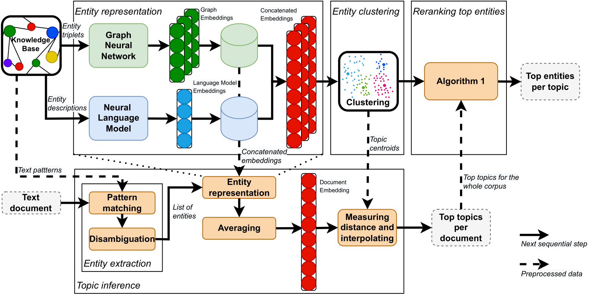
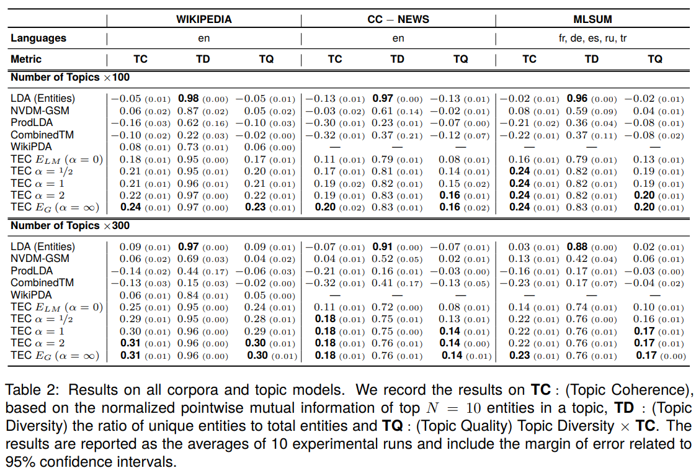

# Topics as Entity Clusters: Entity-based Topics from Large Language Models and Graph Neural Networks

This repository contains the source code for our paper titled _"[Topics as Entity Clusters: Entity-based Topics from
Large Language Models and Graph Neural Networks](https://aclanthology.org/2024.lrec-main.1418/)"_, presented at LREC-Coling 2024. Here, we propose TEC (Topics as
Entity Clusters) a novel approach for extracting topic clusters utilizing large language models and graph neural
networks to analyze and interpret the underlying themes in large text corpora effectively.

## Abstract

Topic models aim to reveal latent structures within a corpus of text, typically through the use of term-frequency
statistics over bag-of-words representations from documents. In recent years, conceptual entities — interpretable,
language-independent features linked to external knowledge resources — have been used in place of word-level tokens,
as words typically require extensive language processing with a minimal assurance of interpretability. However, current
literature is limited when it comes to exploring purely entity-driven neural topic modeling. For instance, despite the
advantages of using entities for eliciting thematic structure, it is unclear whether current techniques are compatible
with these sparsely organised, information-dense conceptual units. In this work, we explore entity-based neural topic
modeling and propose a novel topic clustering approach using bimodal vector representations of entities. Concretely, we
extract these latent representations from large language models and graph neural networks trained on a knowledge base of
symbolic relations, in order to derive the most salient aspects of these conceptual units. Analysis of coherency metrics
confirms that our approach is better suited to working with entities in comparison to state-of-the-art models,
particularly when using graph-based embeddings trained on a knowledge base.

## Overview


*Overview of Topics as Entity Clusters (TEC). The top half illustrates the processing of entity embeddings, topic
centroids and top entities per topic, while the bottom half inferencing the top topics per document.*



---

## Table of Contents

1. [File and Folder Description](#file-and-folder-description)
2. [Environment Setup](#environment-setup)
3. [Paper Experiments](#paper-experiments)
    - [Step 1: Download Wikidata and QRank](#step-1-download-wikidata-and-qrank)
    - [Step 2: Build entity extractor](#step-2-build-entity-extractor)
    - [Step 3: Translate labels](#step-3-translate-labels)
    - [Step 4: Scrape Wikipedia](#step-4-scrape-wikipedia)
    - [Step 5: Update entity extractor with embeddings](#step-5-update-entity-extractor-with-embeddings)
    - [Step 6: Preprocess datasets](#step-6-preprocess-datasets)
    - [Step 7: Run experiments](#step-7-run-experiments)
4. [Training Models](#training-models)
5. [Changelog](#changelog)
6. [Citation](#citation)
7. [License](#license)

---

## File and Folder Description

```shell
├── data
│   └── interim
│       └── wikidatamatcher  # folder containing config files to build the entity extractor
│           ├── entities_add.csv  # forces the addition of specific entities
│           ├── entities_remove.csv  # forces the removal of very general entities
│           ├── facet_of_counts.csv  # lists object counts for predicate 'facet_of', identifies which to include
│           ├── instance_of_counts.csv  # lists object counts for predicate 'instance_of', identifies which to include
│           ├── labels_pairs_de.csv  # label translations for entities with no German labels
│           ├── labels_pairs_es.csv  # label translations for entities with no Spanish labels
│           ├── labels_pairs_fr.csv  # label translations for entities with no French labels
│           ├── labels_pairs_ru.csv  # label translations for entities with no Russian labels
│           ├── labels_pairs_tr.csv  # label translations for entities with no Turkish labels
│           ├── labels_patch.csv  # adds labels to entities, for all languages
│           ├── labels_patch_de.csv  # adds labels to entities in German
│           ├── labels_patch_en.csv  # adds labels to entities in English
│           ├── labels_patch_es.csv  # adds labels to entities in Spanish
│           ├── labels_patch_fr.csv  # adds labels to entities in French
│           ├── labels_patch_ru.csv  # adds labels to entities in Russian
│           ├── labels_patch_tr.csv  # adds labels to entities in Turkish
│           ├── labels_remove.csv  # removes labels, for all languages
│           ├── labels_remove_de.csv  # removes labels in German
│           ├── labels_remove_en.csv  # removes labels in English
│           ├── labels_remove_es.csv  # removes labels in Spanish
│           ├── labels_remove_fr.csv  # removes labels in French
│           ├── labels_remove_ru.csv  # removes labels in Russian
│           ├── labels_remove_tr.csv  # removes labels in Turkish
│           └── subclass_of_counts.csv  # lists object counts for predicate 'subclass_of', identifies which to include
├── paper_experiments
│   ├── other_models
│   │   ├── __init__.py
│   │   ├── run_ctm.sh  # CombinedTM experiment
│   │   ├── run_gsm.sh  # NVDM-GSM experiment
│   │   ├── run_lda.sh  # LDA experiment
│   │   ├── run_prodlda.sh  # ProdLDA experiment
│   │   ├── run_wikipda.sh  # WikiPDA experiment
│   │   ├── train_ctm.py  # Defines a single CombinedTM run
│   │   └── train_lda_mallet.py  # Defines a single LDA run
│   ├── wikidata
│   │   ├── __init__.py
│   │   ├── extract_labels_for_translation.py  # finds entities without labels in a given language
│   │   ├── make_wikidata_property_csv.py  # writes object counts for a predicate
│   │   ├── make_wikidata_summary.py  # converts Wikidata dump entities to .jsonl
│   │   └── merge_labels_with_translations.py  # creates labels_pairs_xx.csv files
│   ├── __init__.py
│   ├── build_entitizer.py  # creates the entity extractor
│   ├── config.json  # defines filep aths and other values
│   ├── prep_ccnews.py  # preprocesses CCNews
│   ├── prep_mlsum.py  # preprocesses MLSUM
│   ├── run_kmeansfaiss.sh  # runs our experiment using KMeans
│   ├── scrape_wikipedia.py  # scrapes Wikipedia articles related to entities in the entity extractor
│   ├── train_kmeansfaiss.py  # defines an individual run 
│   ├── update_entitizer_with_wikidata.py  # add wikidata embeddings to entity extractor
│   ├── update_entitizer_with_wikipedia.py  # add wikipedia embeddings to entity extractor
│   ├── utils.py  # defines assorted functions used with experiments
│   └── wikipedia_embeddings.py  # generates wikipedia embeddings
├── topic_inference
│   ├── collections
│   │   ├── __init__.py
│   │   ├── articlecorpus.py  # defines the ArticleCorpus class
│   │   ├── article.py  # defines the Article class
│   │   ├── coherence.py  # defines multiple classes and functions to compute coherence
│   │   ├── mathdict.py  # defines the mathdict class
│   │   └── namespace.py  # defines the Namespace class
│   ├── lemmatizers
│   │   ├── __init__.py  # defines lemmatizers dict, specifying which to use for each language
│   │   ├── russian_lemmatizer.py  # defines russian lemmatizer
│   │   ├── spacy_lemmatizer.py  # defines multilanguage lemmatizer using SpaCy
│   │   └── turkish_lemmatizer.py  # defines lemmatizer for Turkish
│   ├── models
│   │   ├── __init__.py
│   │   ├── abstracttopicmodel.py  # defines the AbstractTopicModel class
│   │   ├── kmeansfaiss.py  # defines the KMeansFaiss class, subclassing AbstractTopicModel
│   │   └── utils.py  # contains a function to read topics from an excel file
│   ├── multiprocessing
│   │   ├── __init__.py
│   │   ├── parallelizer2file.py  # tool to parallelize the processing of an iterator to a file using a custom function 
│   │   └── parallelizer.py  # tool to parallelize the processing of an iterator using a custom function
│   ├── tokenizers
│   │   ├── __init__.py
│   │   ├── matcher.py  # defines the Matcher class, one is used per language and should wrap an Aho-Corasick automaton
│   │   └── wikidatamatcher.py  # defines the WikidataMatcher class, wraps multiple Matcher instances
│   ├── utils
│   │   ├── __init__.py
│   │   ├── ahocorasick.py  # defines function to build an Aho-Corasick automaton
│   │   ├── data.py  # defines functions to read/write in multiple formats
│   │   ├── general.py  # assorted collection of utils functions
│   │   ├── logger.py  # defines the logger
│   │   ├── qrank.py  # defines function to load QRank data
│   │   ├── setlogginglevel.py  # defines function to set logging level
│   │   ├── similarity.py  # defines multiple functions to measure similarity
│   │   └── string.py  # defines functions to work with strings
│   ├── __init__.py
│   ├── embedding_model.py  # loads the embedding model
│   └── typing.py  # defines types
├── __init__.py
├── diagram.png
├── Makefile
├── README.md
├── requirements.txt
├── results.png
├── setup.py
└── VERSION
```

## Environment Setup

Create a virtual environment and install its requirements and resources:

```shell
python3 -m venv tec
source tec/bin/activate
make requirements
make spacy_resources
```

## Paper Experiments

Below you can find the multiple steps to replicate the experiments documented in the paper.

### Step 1: Download Wikidata and QRank

- **Wikidata**:
    1. Download the latest Wikidata dump for analysis.
    2. Summarize Wikidata by extracting for each entity a set of predicates (e.g., instance_of, citizenship, occupation)
       and its aliases and descriptions in selected languages.
    3. Produce counts that detail the frequency of the predicates across all entities.

- **QRank**: Download and extract the QRank dataset to select entities based on their ranking.

Run the above in the command line using:

```shell
make wikidata
make qrank
```

### Step 2: Build entity extractor

In this step, we build `entitizer.pkl` to be able to extract entities from texts.

The `build_entitizer.py` script constructs an entity extractor by creating and holding language-specific Aho-Corasick
automata. These automata are designed to recognize text patterns correlating to entities in a knowledge base, optimized
by language-specific preprocessing tools like lemmatizers. This design allows for the independent addition of new
languages. The included entities are the top-ranked QRank entities.

```shell
python paper_experiments/build_entitizer.py
```

### Step 3: Translate labels

Some entities do not contain labels in a given language due to the incomplete nature of Wikidata. We run the following
scripts to collect the English labels from entities with missing labels in another given language.

The example below is for Turkish, but it can be easily adapted to other languages:

```shell
python paper_experiments/wikidata/translations/extract_labels_for_translation.py \
    --input paper_experiments/assets/entitizer.pkl \
    --output data/interim/wikidatamatcher/labels_to_translate_tr.txt \
    --language tr
```

An intermediate step not covered in this repository is to translate the labels. The only requirement is for the file
containing the translated labels to have them in the same order, one per line.
We used Huawei Translate to obtain the label translations.

```shell
python paper_experiments/wikidata/translations/merge_labels_with_translations.py \
    --labels data/interim/wikidatamatcher/labels_to_translate_tr.txt \
    --translations data/interim/wikidatamatcher/translated_labels_tr.txt \
    --language tr \
    --output data/interim/wikidatamatcher/labels_pairs_tr.csv
```

For reproducibility, this repository contains the `labels_pairs_xx.csv` files we generated for our experiments.

### Step 4: Scrape Wikipedia

The file `scrape_wikipedia.py` uses Beautiful Soup to scrape the English Wikipedia text of the top QRank entities, after
filtering by specific predicate-object pairs such as Instance Of, Subclass Of, and Facet Of.

```shell
python paper_experiments/scrape_wikipedia.py
```

### Step 5: Update entity extractor with embeddings

Generate Wikipedia embeddings using `wikipedia_embeddings.py`. The script `update_entitizer_with_wikipedia.py` then
updates `entitizer.pkl` with embeddings from Wikipedia pages and the list of entities extracted from each corresponding
Wikipedia page. The Wikidata object entities, and optionally the entities extracted from Wikipedia to increase graph
density, are exported to an edge file. We use `pecanpy` to generate `wikidata.emb`.
Lastly, `update_entitizer_with_wikidata.py` adds these embeddings to `entitizer.pkl`.

```shell
python paper_experiments/wikipedia_embeddings.py
python paper_experiments/update_entitizer_with_wikipedia.py
pecanpy --input paper_experiments/assets/wikidata.edg --output paper_experiments/assets/wikidata.emb --mode FirstOrderUnweighted
python paper_experiments/update_entitizer_with_wikidata.py
```

### Step 6: Preprocess datasets

Preprocessing of the CC-News and MLSUM datasets is performed using `prep_ccnews.py` and `prep_mlsum.py` scripts,
respectively. These scripts extract entities considering the source language and disambiguate embeddings to remove
spurious matches.

```shell
python paper_experiments/prep_ccnews.py
python paper_experiments/prep_mlsum.py
```

### Step 7: Run experiments

To demonstrate the capabilities of TEC, we perform a comprehensive analysis comparing it against state-of-the-art topic
models across various corpora. Our experiments, detailed in the paper, focus on the performance of TEC by examining
entity clusters and assessing them using several coherence metrics. The experiments can be executed by running the
following scripts:

```shell
python paper_experiments/run_kmeansfaiss.sh
python paper_experiments/other_models/run_lda.sh
python paper_experiments/other_models/run_gsm.sh
python paper_experiments/other_models/run_prodlda.sh
python paper_experiments/other_models/run_ctm.sh
python paper_experiments/other_models/run_wikipda.sh
```

These scripts facilitate the comparison of TEC with other topic models, such as LDA, NVDM-GSM, ProdLDA, CombinedTM, and
WikiPDA, across datasets Wikipedia, CC-News, and MLSUM. For further explanation, refer to our paper.

## Training Models

Outside of the experiments, we can generate topics by running different trainings. Below are some examples of usage:

- **Wikipedia with Language Model Embeddings and 200 topics**:
  ```shell
  python paper_experiments/train_kmeansfaiss.py --dataset wikipedia --embedding-type wikipedia  --num-topics 200
  ```

- **MLSUM with Graph Embeddings and Fixed Seed**:
  ```shell
  python paper_experiments/train_kmeansfaiss.py --dataset mlsum --embedding-type wikidata --seed 42
  ```

- **Combining Embeddings with Specific Alpha on GPU**:
  ```shell
  python paper_experiments/train_kmeansfaiss.py --dataset mlsum --embedding-type both --alpha 0.5 --device 0
  ```

---

## Changelog

### 1.0.0

This is the initial release of the code used in the paper.

## Citation

Please cite our paper if you use this code in your research:

Loureiro, Manuel V., Steven Derby, and Tri Kurniawan Wijaya. "Topics as Entity Clusters: Entity-based Topics from Large
Language Models and Graph Neural Networks." Proceedings of the 2024 Joint International Conference on Computational
Linguistics, Language Resources and Evaluation (LREC-COLING 2024). 2024.

```
@inproceedings{loureiro-etal-2024-topics-entity,
    title = "Topics as Entity Clusters: Entity-based Topics from Large Language Models and Graph Neural Networks",
    author = "Loureiro, Manuel V.  and
      Derby, Steven  and
      Wijaya, Tri Kurniawan",
    editor = "Calzolari, Nicoletta  and
      Kan, Min-Yen  and
      Hoste, Veronique  and
      Lenci, Alessandro  and
      Sakti, Sakriani  and
      Xue, Nianwen",
    booktitle = "Proceedings of the 2024 Joint International Conference on Computational Linguistics, Language Resources and Evaluation (LREC-COLING 2024)",
    month = may,
    year = "2024",
    address = "Torino, Italia",
    publisher = "ELRA and ICCL",
    url = "https://aclanthology.org/2024.lrec-main.1418",
    pages = "16315--16330",
    abstract = "Topic models aim to reveal latent structures within a corpus of text, typically through the use of term-frequency statistics over bag-of-words representations from documents. In recent years, conceptual entities {---} interpretable, language-independent features linked to external knowledge resources {---} have been used in place of word-level tokens, as words typically require extensive language processing with a minimal assurance of interpretability. However, current literature is limited when it comes to exploring purely entity-driven neural topic modeling. For instance, despite the advantages of using entities for eliciting thematic structure, it is unclear whether current techniques are compatible with these sparsely organised, information-dense conceptual units. In this work, we explore entity-based neural topic modeling and propose a novel topic clustering approach using bimodal vector representations of entities. Concretely, we extract these latent representations from large language models and graph neural networks trained on a knowledge base of symbolic relations, in order to derive the most salient aspects of these conceptual units. Analysis of coherency metrics confirms that our approach is better suited to working with entities in comparison to state-of-the-art models, particularly when using graph-based embeddings trained on a knowledge base.",
}
```

## License

This repository is released under the [MIT License](LICENSE).
